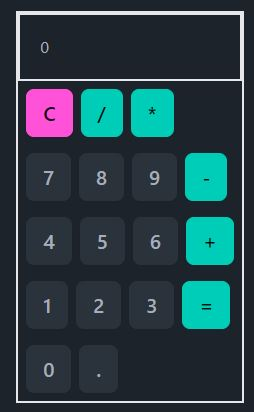

# Calculator App

This is a simple calculator web application built using React.js and Tailwind CSS.



## Features

- Addition, subtraction, multiplication, and division operations.
- Clear button to reset the calculator.
- Responsive design for seamless usage on different devices.

## Installation

Install dependencies:

```
npm install
```

## Usage

1. Start the development server:

```
npm start
```

## Technologies Used

- React.js
- Tailwind CSS
